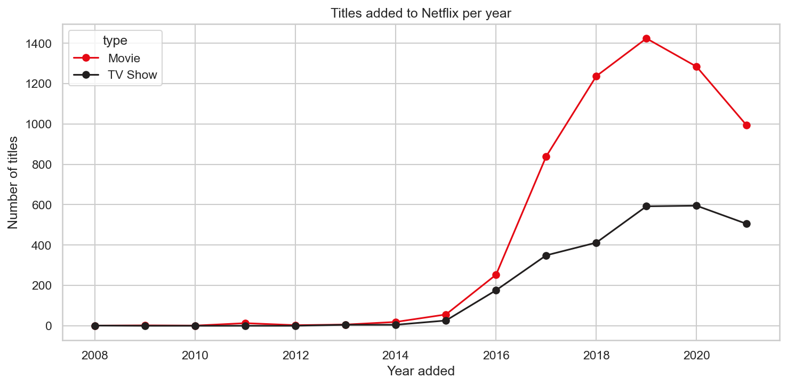
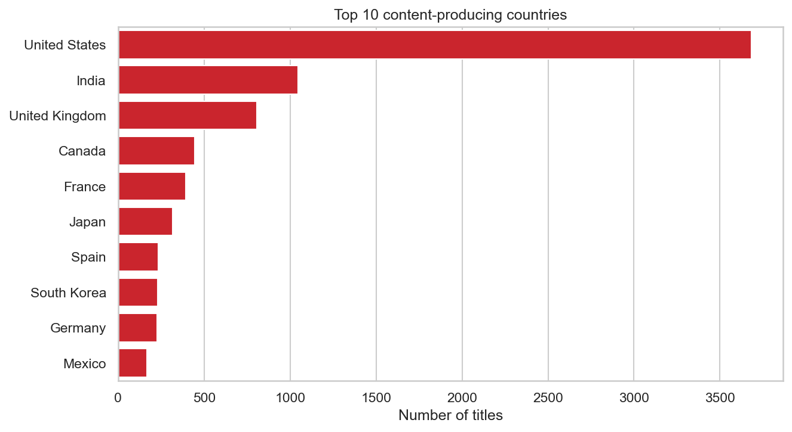
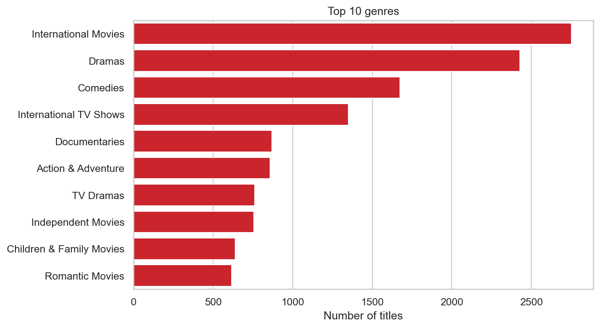

# 🎬 Netflix Content Visualization

Exploratory data analysis and visualization of Netflix's catalog of movies and TV shows: what it contains, where it comes from, and how it has changed over time.

## Dataset
[Netflix Movies and TV Shows](https://www.kaggle.com/datasets/shivamb/netflix-shows) (Kaggle). Download `netflix_titles_2021.csv` and place it in `data/raw/`.

- 8,807 titles, 12 columns
- Columns: `show_id, type, title, director, cast, country, date_added, release_year, rating, duration, listed_in, description`

## Tools
Python, pandas, matplotlib, seaborn, plotly, wordcloud, Streamlit

## Project structure
```
netflix_content_visualization/
├── data/
│   ├── raw/            original dataset (not committed)
│   └── processed/      cleaned dataset
├── notebooks/
│   ├── 01_data_exploration.ipynb
│   ├── 02_data_cleaning.ipynb
│   └── 03_visualization.ipynb
├── images/             saved charts
├── requirements.txt
├── README.md
└── .gitignore
```

## Cleaning steps
- Checked for duplicate rows (none found)
- Filled missing `director`, `cast`, `country` and `rating` with "Unknown"
- Fixed 3 rows where the movie runtime was typed into the `rating` column
- Dropped 10 rows with no `date_added`
- Parsed `date_added` and extracted year and month
- Split `duration` into movie minutes and TV show seasons

## Key findings
1. **Movie-heavy catalog:** about 70% of titles are movies and 30% are TV shows.
2. **Rapid growth after 2015:** additions were minimal before 2015, took off in 2016, and peaked around 2019-2020.
3. **No strong seasonality:** additions are spread evenly across months, with small peaks in July and December.
4. **US dominance:** the US has about 3.5x more titles than India, the second-largest country.
5. **Drama, comedy and international content lead** the genre rankings.
6. **Mature audience focus:** TV-MA and TV-14 make up about 60% of titles.
7. **Standard movie length:** the median movie runs 98 minutes.
8. **Short-lived series:** about two-thirds of TV shows have only one season.
9. **Fresh content:** over half of titles were added within about 2 years of release.

## Screenshots




## Limitations
- The data ends around September 2021, so 2021 is an incomplete year.
- Titles with several countries or genres are counted once per value, so counts overlap.
- The dataset shows what Netflix offers, not what people watch.
